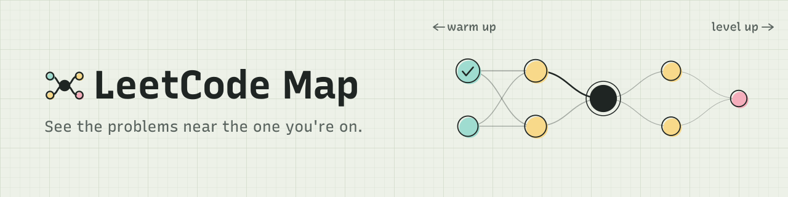
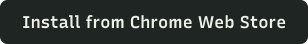
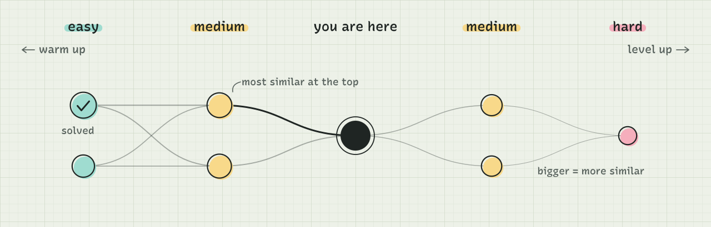
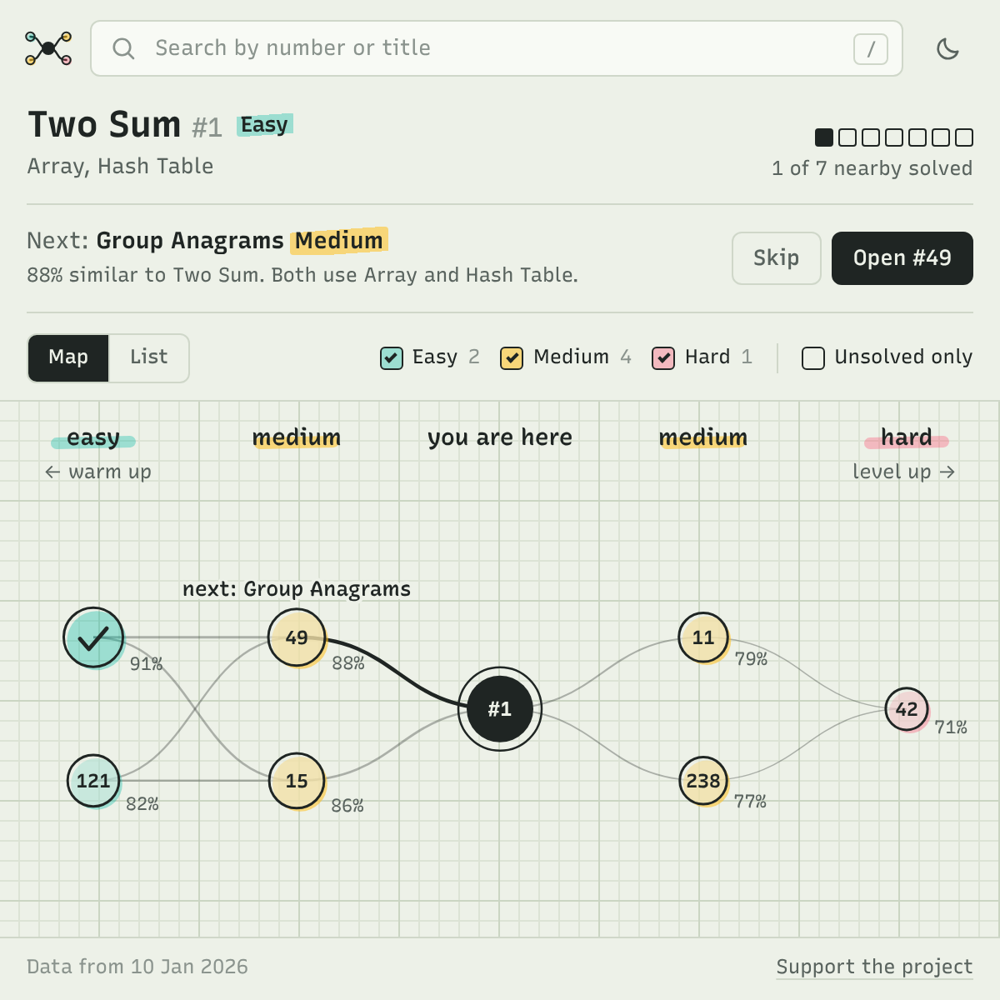

<picture>
  <source media="(prefers-color-scheme: dark)" srcset="assets/banner-dark.svg">
  
</picture>

  
  
  

  <a href="https://chromewebstore.google.com/detail/leetcode-map/hbponnlnmcomlbplhcbhfaeckbnngdim"><picture><source media="(prefers-color-scheme: dark)" srcset="assets/btn-install-dark.svg"></picture></a>&nbsp;
  <a href="https://github.com/shashankswe2020-ux/leetcode-map-support/issues/new?template=bug_report.yml"><picture><source media="(prefers-color-scheme: dark)" srcset="assets/btn-bug-dark.svg"></picture></a>&nbsp;
  <a href="https://github.com/shashankswe2020-ux/leetcode-map-support/issues/new?template=feature_request.yml"><picture><source media="(prefers-color-scheme: dark)" srcset="assets/btn-idea-dark.svg"></picture></a>

LeetCode Map is a Chrome extension for practising on LeetCode. Open a problem, click the icon, and it shows you the problems that use the same idea: easier ones to warm up with when you're stuck, and harder ones to try once you've solved it.

This repository is where you report bugs and ask for features. The extension's source code isn't public.

## What's new in 1.2.2

- **Solved problems sync from LeetCode.** If you're signed in, the problems you've solved there are marked automatically, so **Unsolved only** just works.
- **A calmer popup.** Less clutter, more room for long titles, and at most six problems per column on busy maps.
- **New look in 1.2.1:** paper and slate themes, a notebook-style map, and a **Next** suggestion that says why it was picked.

See every version in the [changelog](CHANGELOG.md).

## How it works

<picture>
  <source media="(prefers-color-scheme: dark)" srcset="assets/how-it-works-dark.svg">
  
</picture>

1. Open any problem on [leetcode.com](https://leetcode.com/problemset/).
2. Click the LeetCode Map icon in Chrome's toolbar.
3. Open the suggested **Next** problem, or pick any problem from the map.

Similar problems are found by comparing what each problem asks you to do, not just its tags.

  <picture>
    <source media="(prefers-color-scheme: dark)" srcset="assets/popup-dark.png">
    
  </picture>

## What you can do

- **See related problems on a map**: easier problems on the left, harder on the right, laid out in layers by difficulty.
- **Get a next problem**: see the most similar problem you haven't solved, at most one level harder, and why it was picked. Skip for another.
- **Check how similar a problem is**: click a node to see its difficulty, its similarity score and the topics it shares with your problem.
- **Filter**: show Easy, Medium or Hard, or unsolved problems only.
- **Track progress**: problems you've solved on LeetCode are marked automatically when you're signed in, or mark them yourself (right-click a node works too).
- **Switch to a list**: the same problems as a list you can scan.
- **Search**: jump to any of the 3,900+ problems by number or title.
- **Work offline**: your 20 most recent maps open without a connection.
- **Light or dark**: paper and slate themes that follow your system setting.

## Get help

**Found a bug?** [Open a bug report](https://github.com/shashankswe2020-ux/leetcode-map-support/issues/new?template=bug_report.yml). The form asks for the problem you were on and what happened, which is usually all I need to reproduce it.

**Have an idea?** [Suggest a feature](https://github.com/shashankswe2020-ux/leetcode-map-support/issues/new?template=feature_request.yml), or add a 👍 to an [existing request](https://github.com/shashankswe2020-ux/leetcode-map-support/issues?q=is%3Aissue+label%3Aenhancement) so I know what matters most.

**Prefer email?** Write to [shashank.swe.2020@gmail.com](mailto:shashank.swe.2020@gmail.com).

## Questions

<b>Does LeetCode Map collect my data?</b>

 
No. You don't need an account. Your solved problems, including any synced from LeetCode, are stored only in your own browser and never sent to LeetCode Map's server. To draw a map, the extension asks its server for the problems related to the one you're viewing. Read the full <a href="https://gist.github.com/shashankswe2020-ux/00599fca1a28a0aa4af5f52600f847d9">privacy policy</a>.

<b>How does solved-problem sync work?</b>

 
When you open the popup on a LeetCode problem while signed in, it asks LeetCode, through that tab, which of the problems on your map you've solved, and marks them. Problems you've marked yourself are kept. If you're signed out, manual marks work as before.

<b>Which sites does it work on?</b>

 
Problem pages on leetcode.com (<code>leetcode.com/problems/…</code>). On any other page, you can still search for a problem from the popup.

<b>How are problems matched?</b>

 
Each problem's description is compared with every other problem's, so two problems can match even when LeetCode tags them differently. The map shows the closest matches, and the score on each one tells you how close it is.

<b>Why doesn't the map show every problem in a topic?</b>

 
It shows the problems closest to the one you're on, not everything with the same tag. Busy maps show up to six problems per column; switch to List to see every related problem.

<b>How up to date is the problem list?</b>

 
The popup's footer shows when the dataset was last updated. New LeetCode problems appear after the next update.

---

  Made by <a href="https://github.com/shashankswe2020-ux">Shashank</a>. If LeetCode Map helps you practise, you can <a href="https://buymeacoffee.com/shashanksw9">support the project</a>. 
  <a href="https://gist.github.com/shashankswe2020-ux/00599fca1a28a0aa4af5f52600f847d9">Privacy policy</a>

